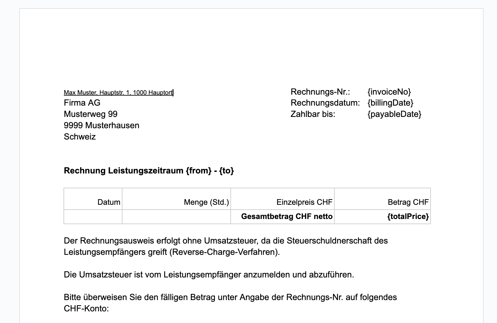

# Time tracking

Collection of NodeJS scripts to make time tracking and invoicing easier.

1. [Print records to console (index.js)](#print-records-to-console)
2. [Push records to the Jira Tempo worklog (push-jira.js)](#push-records-to-the-jira-tempo-worklog)
3. [Create invoice as Google Doc (invoice.js)](#create-invoice-as-google-doc)

## Getting started

Install dependencies:

```
npm install
```

Add file `.env.local` with the following content (replace '${placeholders}' with the actual values):

```
TOGGL_API_TOKEN=${toggl api token}
TOGGL_PROJECT_ID=${toggl project id - optional}
```
## Print records to console

Call script:

```
node index.js ${month-arg in yyyy-mm}
```

e.g. `node index.js 2023-04`

## Push records to the Jira Tempo worklog

Prerequisites:
1. Create an API Token for Jira here: https://id.atlassian.com/manage-profile/security/api-tokens
2. Create an API Token for Tempo here: https://{yourdomain}.atlassian.net/plugins/servlet/ac/io.tempo.jira/tempo-app#!/configuration/api-integration

Add the following additional variables to `.env.local`:

```
JIRA_DOMAIN=${your jira subdomain}
JIRA_USERNAME=${jira username}
JIRA_API_TOKEN=${previously created jira api token}
TEMPO_API_TOKEN=${previously created tempo api token}
```

Call script (dry mode - logs only):
```
node push-jira.js ${month-arg in yyyy-mm}
```
e.g. `node push-jira.js 2023-12`

Call script (commit mode):
```
node push-jira.js ${month-arg in yyyy-mm} commit
```
e.g. `node push-jira.js 2023-12 commit`

## Create invoice as Google Doc

Prerequisites:

1. Create a Service Account and download the key as `credentials.json` to this directory
   (https://console.cloud.google.com/iam-admin/serviceaccounts)

### Write an invoice

#### Step 1: Create a Google Doc to write to.

   It can contain the following variables:
- `{invoiceNo}`
- `{billingDate}`
- `{payableDate}`
- `{from}`
- `{to}`
- `{totalPrice}`

Furthermore, it must contain a table like shown in the following screenshot.
The daily records are inserted between the heading and the totals line.



It is recommended to create a template document which can be copied for each
new invoice.

#### Step 2: Share the new Google Doc with your Service Account

Get the email address of the Service Account (see `client_email` in `credentials.json`)
and click on "Share" on Google Doc to grant Editor access to the new document.

#### Step 3: Call the invoice script

```
node invoice.js ${month-arg in yyyy-mm} ${invoice-no} ${hourly-rate} ${document id}
```
e.g. `node invoice.js 2023-12 20230897 120 1eDKe5SyiKLPAFdPgsuXdMT1sheIhvcOnfQafyNMsf9wasdfasdf`
   
This replaces all the variables in the documents and inserts the time records into the
prepared table.
